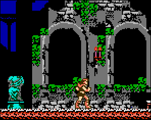

## Castlevania 3 Improved Controls Hack

### Using or Contributing to This Repository

[Read instructions here.](./SETUP.md)

### About this hack

> A godsend for CV3. Makes this frustrating game
> tons more bearable and I recommend it if CV3’s
> clunky controls pissed you off, which of course,
> they did. Everything feels smooth and retains a
> professional level of hacking skill. It feels as
> if this was how the game was meant to be made
> rather than most clunky hacks.

- [ROMHacking.net user PROTOBlues](http://www.romhacking.net/reviews/2938/#review)

This hack modernizes the control scheme of Castlevania 3 to make it less frustrating to people used to tighter controls,
including giving the player more control while jumping.

**Complete list of changes**:

- Enables all characters to control their x-velocity in mid-air while jumping (including while jump attacking); Grant’s jumping controls remain unchanged.
- When releasing the jump button, one immediately starts falling again; this allows the player to make smaller hops if desired. (Does not apply to Grant.)
- After being knocked back, the player regains control after a split second and can angle their fall.
- When walking off an edge, the player retains control instead of dropping straight down.
- All characters can jump off of stairs at any point in the climb (however, it is still impossible to land on stairs, so be careful
	jumping from long flights of stairs over pits)

Compatible with the English translation of Akumajou Densetsu located here: http://www.romhacking.net/hacks/1983/